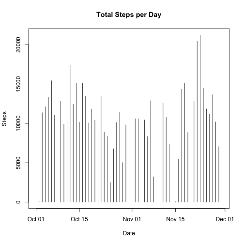

Reproducible Research Course Project #1  
===============================================  

By Tim Davison  
April 13, 2017  

Question #1  
What is the code for reading in the dataset?    

```r
activity <- read.csv("activity.csv", comment.char = "", colClasses = c("integer", "Date", "integer"))
```
What is the code for processing the data (group by date, and sum per day)?    


```r
dateGroup <- group_by(activity, date)
stepsDate <- summarise(dateGroup, StepsSum=sum(steps))
```
Question #2  
Make a histogram of the total number of steps taken each day.  

```r
plot(stepsDate, type="h", main="Total Steps per Day", xlab= "Date", ylab="Steps")
```



Question #3  
What are the mean and median number of total steps taken each day?  

```r
mean(stepsDate$StepsSum, na.rm = T)
```

```
## [1] 10766.19
```

```r
median(stepsDate$StepsSum, na.rm = T)
```

```
## [1] 10765
```
Question #4  
Make a time series plot of the average steps per interval.  

```r
intervalGroup <- group_by(activity, interval)
stepsIntervalMean <- summarize(intervalGroup, IntervalMean=mean(steps, na.rm = TRUE))
plot(stepsIntervalMean, type="l", main="Average Steps per Interval", xlab= "Interval", ylab="Steps")
```


Question #5  
Find the 5-minute interval that, on average, contains the maximum number of steps per day.  

```r
filter(dateGroup, steps==max(steps))
```

```
## Source: local data frame [55 x 3]
## Groups: date [53]
## 
##    steps       date interval
##    <int>     <date>    <int>
## 1    117 2012-10-02     2210
## 2    613 2012-10-03      620
## 3    547 2012-10-04     1815
## 4    555 2012-10-05     1210
## 5    526 2012-10-06     1840
## 6    523 2012-10-07     1710
## 7    748 2012-10-09      810
## 8    413 2012-10-10     1205
## 9    748 2012-10-11      825
## 10   802 2012-10-12      900
## # ... with 45 more rows
```

Question #6  
Describe a strategy for imputing missing data.  
  
I found that the steps data was either present for every interval of a given day, or it was completely missing for the day. There are not any days that have some steps data and some NA values. So, I simply calculated the overall mean of steps per day and substituted that value for each day that has all NA values.  

Here is the code for imputing missing data:  

```r
meanSteps <- mean(activity$steps, na.rm = T)
activity[is.na(activity)] <- meanSteps
dateGroup <- group_by(activity, date)
stepsDateMean <- summarize(dateGroup, StepsMean=mean(steps, na.rm = TRUE))
```

Question #7  
And, here is the code for the histogram of Total Steps per Day, with imputed values:  

```r
plot(stepsDateMean, type="h", main="Total Steps per Day", xlab= "Date", ylab="Steps")
```


Question #8  
Create a new weekday / weekend factor variable.  

```r
activity2 <- mutate(activity, Day_Type= weekdays(date))
activity2 <- mutate(activity2, Day_Type2 = factor(activity2$Day_Type, 
    levels = c("Monday", "Tuesday", "Wednesday", "Thursday", "Friday", "Saturday", "Sunday"), 
    labels = c("weekday", "weekday", "weekday", "weekday", "weekday", "weekend", "weekend")))
```

```
## Warning in `levels<-`(`*tmp*`, value = if (nl == nL) as.character(labels)
## else paste0(labels, : duplicated levels in factors are deprecated
```
Group by interval and weekday factor, then find the mean steps per interval.  

```r
intervalGroup <- group_by(activity2, interval, Day_Type2)
stepsIntervalMean <- summarize(intervalGroup, IntervalMean=mean(steps, na.rm = TRUE))
```
Make a panel plot comparing the average number of steps taken per 5-minute interval across weekdays and weekends.  

```r
par(mfrow=c(2,1))
with(subset(stepsIntervalMean, Day_Type2=="weekday"), plot(interval, IntervalMean, type="l", main="Weekday", xlab= "Interval", ylab="Steps"))
with(subset(stepsIntervalMean, Day_Type2=="weekend"), plot(interval, IntervalMean, type="l", main="Weekend", xlab= "Interval", ylab="Steps"))
```


The End.
